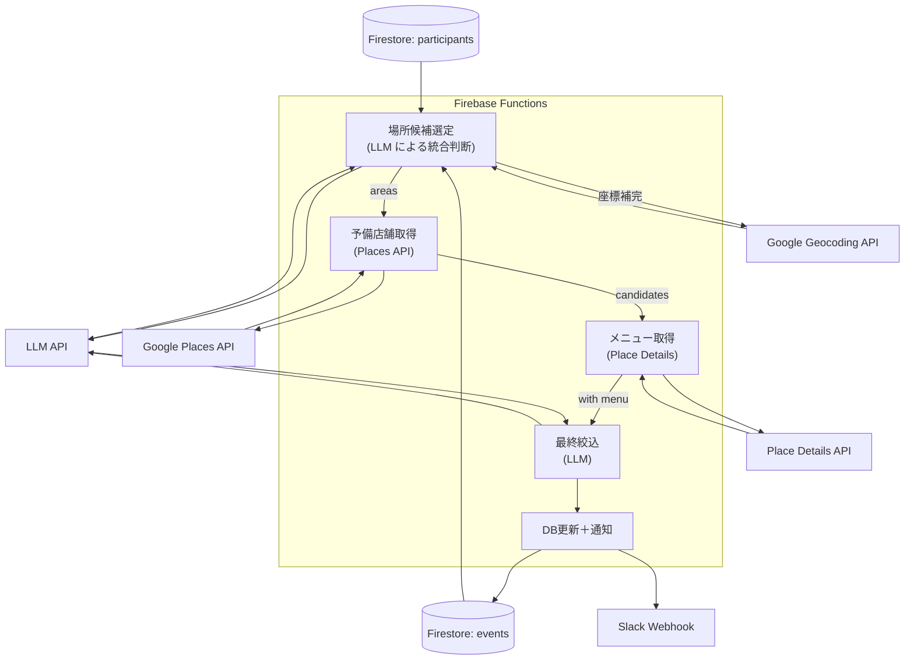

# 3. ステップ3: 日程・お店決定（AIアルゴリズム）

# 事前のDB構造

### ① 参加者情報

**コレクションパス**: `events/{eventId}/participants/{participantId}`

各ドキュメントフィールド：

必須内容

- `name` (String)
- `phoneNumber` (String)
- `positionOrGrade` (String)
- `desiredBudget` (Number)
- `desiredDates` (Array<timestamp>)
- `desiredLocations` (Array<String>)
- `allergiesEtc` (String)
- `submittedAt` (Timestamp)

追加の質問

- `fixedQuestionAnswers/{questionId}` (question: String, answer: String) 幹事の画面で生成された参加者間では固定の質問
- `customQuestionAnswers/{questionId}` (question: String, answer: String)参加者間で異なる質問

### ② 幹事／イベント基本情報

**ドキュメントパス**: `events/{eventId}`

フィールド：

- `organizerId` (Array<String>)
- `eventName` (String)
- `dueDate` (Timestamp)
- `minutes` (Number: 分)
- `budgetUpperLimit` (Number: 円)
- `fixedQuestion` (Array<String>)
- `candidateDateTimes/{dateTimeId}`
    - `start` (Timestamp)
    - `end` (Timestamp)
- `candidateAreas/{areaId}`
    - `center` (GeoPoint)
    - `radius` (Number: メートル)
- `aiRecArea` String
- `aiRecDate` Timestamp
- `aiRecStore` Array<String>

# 更新後に使用するDB構造

### ① 結果格納用サブドキュメント

**ドキュメントパス**: `events/{eventId}/result`

フィールド：

- `optimalDate` (Timestamp) — 最適開始日時
- `optimalEnd` (Timestamp) — 最適終了日時
- `restaurants` (Array<Map>) — 候補店舗リスト
    - 各Mapのキー：
        - `name` (String)
        - `formatted_address`(String)
        - `rating` (Number)
        - `priceLevel` (Number)
        - `menuHighlights` (String)
        - `accessInfo` (String)
        - `placeId` (String)

## ① 前提データ

- **Firestore**
    - `events/{eventId}`
        - `budgetUpperLimit` (Number)
        - `minutes` (Number: 分)
        - `purpose` (String: "歓迎会"など)
    - `events/{eventId}/participants/*`
        - `desiredLocations` (Array<String>)
        - `desiredDates` (Array<Timestamp>)
        - `positionOrGrade`, `allergiesEtc`, `desiredBudget`…
- **外部API**
    - **Google Geocoding API**：住所→緯度経度
    - **Google Places API**：エリア検索、店舗検索
    - **Place Details API**：メニュー情報取得
    - **生成AI（Gemini API）**：要件整理・候補絞り込み

---

## ② 場所候補生成フェーズ

### 2-1. データ取得

1. Firestore から `desiredLocations` を集約。
2. 参加者の属性情報（`positionOrGrade`、`desiredBudget`、`allergiesEtc`等）も併せて取得。

### 2-2. LLM による場所候補生成

参加者の希望場所と属性情報をもとに、LLMで直接最適な場所候補を生成します。

- **プロンプト例**
    
    > 「以下の参加者情報をもとに、飲み会開催に最適な 3つの場所候補 を提案してください。
    > 
    > **参加者情報:**
    > - 希望場所: ${desiredLocations}（例：["新宿", "渋谷駅近く", "会社付近"]）
    > - 参加者構成: ${positionOrGrade}（例：["新入社員", "課長", "部長"]）
    > - 予算範囲: ${budgetRange}円/人
    > - 目的: ${purpose}（例："歓迎会"）
    > - 特別な考慮事項: ${allergiesEtc}
    > 
    > **選定基準:**
    > - 交通アクセスの良さ（複数路線利用可能）
    > - 参加者の年齢層・立場に適した雰囲気
    > - 予算に見合った店舗密度
    > - エリアの治安・安全性
    > 
    > JSON配列で以下の形式で返してください：
    > `{ "name": "エリア名", "center": {"lat": 緯度, "lng": 経度}, "radius": 検索半径(m), "reason": "選定理由", "suitableFor": "適している参加者層" }`」
    > 
- **LLM の返却例**
    
    ```json
    [
      {
        "name": "新宿三丁目エリア", 
        "center": {"lat": 35.6938, "lng": 139.7034},
        "radius": 2000,
        "reason": "JR・私鉄・地下鉄が集中し全員がアクセスしやすく、予算帯に応じた店舗が豊富",
        "suitableFor": "多世代混在の歓迎会"
      },
      {
        "name": "恵比寿駅周辺",
        "center": {"lat": 35.6467, "lng": 139.7101}, 
        "radius": 1500,
        "reason": "落ち着いた大人の雰囲気で上司部下の距離感を保ちやすく、品質の高い店舗が多い",
        "suitableFor": "年齢層高め・格式重視"
      },
      {
        "name": "渋谷センター街周辺",
        "center": {"lat": 35.6595, "lng": 139.7005},
        "radius": 1800, 
        "reason": "若手社員に人気のエリアで活気があり、カジュアルな雰囲気作りに最適",
        "suitableFor": "新入社員中心・カジュアル"
      }
    ]
    ```

### 2-3. 地理情報の補完

LLMが提案した場所候補について、必要に応じてGeocoding APIで座標の精度を向上：

1. LLMが提案した座標が大まかな場合、Geocoding APIで「{エリア名} 駅」等の具体的な座標を取得
2. 提案された `radius` が適切かを検証し、店舗密度に応じて調整

---

## 3. お店決定フェーズ

### 3-1. エリアごとの予備店舗取得

各エリア候補に対して以下をループで実行：

1. **Places API 検索**
    - `location`＝center, `radius`＝radius,
    - `minprice`＝0, `maxprice`＝ceil(budgetUpperLimit ÷ participantCount / 1000)
    - `keyword`＝`purpose` + "飲み会"
2. **取得項目**
    - `name`, `place_id`, `rating`, `user_ratings_total`,
    - `opening_hours`, `price_level`

### 3-2. メニュー情報取得

上位 10 件程度に対して Place Details API で：

- `menuHighlights`（コース情報・人気メニュー）、
- `photos`（イメージ）、
- `website`（メニュー掲載ページ）

### 3-3. AI エージェントによる最終絞り込み

- **プロンプト例**
    
    > 「以下の店舗候補リストと参加者情報をもとに、
    > 
    > - 参加人数 X 名
    > - 予算上限 Y 円/人
    > - アレルギー情報: …
    > - 目的: ${purpose}
    > 
    > をすべて満たす **最適な 3 店舗** を選定し、
    > 
    > `{ name, placeId, rating, priceLevel, menuHighlights, accessInfo, recommendedTimeSlot, reason }` の JSON 配列で返してください。
    > 
    > `recommendedTimeSlot` は各店舗の営業時間と参加者の希望日程を突き合わせた "YYYY-MM-DD HH:MM〜" 形式でお願いします。」
    > 
- **AI の返却例**
    
    ```json
    json
    コピーする編集する
    [
      {
        "name":"渋谷クラフトビアバー",
        "placeId":"ChIJaW4N6BeMGAAR5_encoding",
        "rating":4.3,
        "priceLevel":2,
        "menuHighlights":"クラフトビール20種・ビーガンコース",
        "accessInfo":"渋谷駅ハチ公口 徒歩4分",
        "recommendedTimeSlot":"2025-07-15 19:00〜21:00",
        "reason":"ビールの品揃え豊富で予算内、駅近"
      },
      …(3件中2件目以降)…
    ]
    
    ```
    

### 3-4. DB 更新 & 通知

1. Firestore に以下を書き込み
    
    ```
    text
    コピーする編集する
    events/{eventId}/result:
      optimalDate: Timestamp("2025-07-15T19:00:00Z")
      optimalEnd:  Timestamp("2025-07-15T21:00:00Z")
      restaurants: [ …AI返却JSON… ]
    
    ```
    
2. Slack/Webhook で幹事へリッチ通知
    - 日程・店舗名・理由・メニューイメージを含むブロック形式

---

## 4. Mermaid：詳細フロー



---

## 実装方針

1. **トリガー**
    - 参加者集計完了 or 幹事「提案生成」クリック
2. **環境設定**
    - Firebase Functions（Node.js）
    - 環境変数で API キー（Google Places, Slack Webhook）を管理
3. **レート制御 & キャッシュ**
    - Places API のレート上限に合わせてクエリキャッシュ or バックオフ実装
4. **フォールバック**
    - 位置情報なし → エリア候補の `center` をそのまま使用
    - APIエラー時は最大３回リトライ（指数バックオフ）
5. **UX 検討**
    - 候補店舗を地図上ピン表示
    - 幹事が手動で日程／店舗を差し替えられる「編集モード」を実装
    - 通知文には必ず「決定日程」「店舗名」「アクセス」「予算目安」を含める