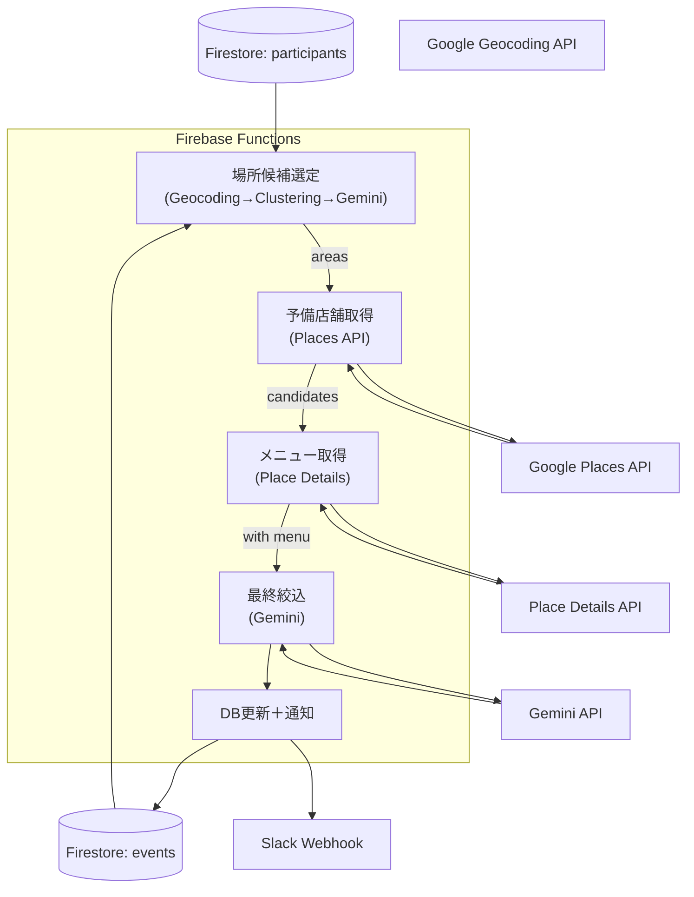

# 3. ステップ3: 日程・お店決定（AIアルゴリズム）

# 事前のDB構造

### ① 参加者情報

**コレクションパス**: `events/{eventId}/participants/{participantId}`

各ドキュメントフィールド：

必須内容

- `name` (String)
- `phoneNumber` (Number)
- `positionOrGrade` (String)
- `desiredBudget` (Number)
- `desiredDates` (Array<timestamp>)
- `desiredLocations` (Array<String>)
- `allergiesEtc` (String)
- `submittedAt` (Timestamp)

追加の質問

- `fixedQuestionAnswers/{questionId}` (question: String, answer: String) 幹事の画面で生成された参加者間では固定の質問
- `customQuestionAnswers/{questionId}` (question: String, answer: String)参加者間で異なる質問

### ② 幹事／イベント基本情報

**ドキュメントパス**: `events/{eventId}`

フィールド：

- `organizerId` (Array<String>)
- `eventName` (String)
- `dueDate` (Timestamp)
- `minuites` (Number: 分)
- `budgetUpperLimit` (Number: 円)
- `fixedQuestion` (Array<String>)
- `candidateDateTimes/{dateTimeId}`
    - `start` (Timestamp)
    - `end` (Timestamp)
- `candidateAreas/{areaId}`
    - `center` (GeoPoint)
    - `radius` (Number: メートル)
- `aiRecArea` String
- `aiRecDate` Timestamp
- `aiRecStore` Array<String>

# 更新後に使用するDB構造

### ① 結果格納用サブドキュメント

**ドキュメントパス**: `events/{eventId}/result`

フィールド：

- `optimalDate` (Timestamp) — 最適開始日時
- `optimalEnd` (Timestamp) — 最適終了日時
- `restaurants` (Array<Map>) — 候補店舗リスト
    - 各Mapのキー：
        - `name` (String)
        - `formatted_address`(String)
        - `rating` (Number)
        - `priceLevel` (Number)
        - `menuHighlights` (String)
        - `accessInfo` (String)
        - `placeId` (String)

## ① 前提データ

- **Firestore**
    - `events/{eventId}`
        - `budgetUpperLimit` (Number)
        - `length` (Number: 分)
        - `purpose` (String: “歓迎会”など)
    - `events/{eventId}/participants/*`
        - `desiredLocations` (Array<String>)
        - `desiredDates` (Array<String: “YYYY-MM-DD”>)
        - `positionOrGrade`, `allergiesEtc`, `desiredBudget`…
- **外部API**
    - **Google Geocoding API**：住所→緯度経度
    - **Google Places API**：エリア検索、店舗検索
    - **Place Details API**：メニュー情報取得
    - **生成AI（Gemini API）**：要件整理・候補絞り込み

---

## ② 場所候補生成フェーズ

### 2-1. データ取得

1. Firestore から `desiredLocations` を集約。
2. Geocoding API で各 `desiredLocation` → `(lat, lng)` を算出。

### 2-2. クラスタリング & 候補抽出

1. すべての `(lat, lng)` をクラスタリング（例：K-means, DBSCAN）し、代表中心点を取得。
2. 各クラスタ中心点に対して、固定半径（例：3km）で検索可能なエリア候補を作成。

### 2-3. 生成AI による絞り込み

- **プロンプト例**
    
    > 「以下の地理座標クラスタ中心点をもとに、アクセス（駅からの距離）、治安、エリアの雰囲気などを加味して、飲み会に最適な 3 つの開催エリア を選んでください。JSON 配列で { name, center: {lat,lng}, reason } を返してください。」
    > 
- **Gemini の返却例**
    
    ```json
    json
    コピーする編集する
    [
      {"name":"渋谷駅周辺","center":{"lat":35.6595,"lng":139.7005},"reason":"主要路線が集まる交通の要所"},
      {"name":"新宿三丁目","center":{"lat":35.6938,"lng":139.7034},"reason":"飲食店が多く予算内に選択肢豊富"},
      {"name":"恵比寿","center":{"lat":35.6467,"lng":139.7101},"reason":"落ち着いた雰囲気でビールバーが充実"}
    ]
    
    ```
    

---

## 3. お店決定フェーズ

### 3-1. エリアごとの予備店舗取得

各エリア候補に対して以下をループで実行：

1. **Places API 検索**
    - `location`＝center, `radius`＝radius,
    - `minprice`＝0, `maxprice`＝ceil(budgetUpperLimit ÷ participantCount / 1000)
    - `keyword`＝`purpose` + “飲み会”
2. **取得項目**
    - `name`, `place_id`, `rating`, `user_ratings_total`,
    - `opening_hours`, `price_level`

### 3-2. メニュー情報取得

上位 10 件程度に対して Place Details API で：

- `menuHighlights`（コース情報・人気メニュー）、
- `photos`（イメージ）、
- `website`（メニュー掲載ページ）

### 3-3. AI エージェントによる最終絞り込み

- **プロンプト例**
    
    > 「以下の店舗候補リストと参加者情報をもとに、
    > 
    > - 参加人数 X 名
    > - 予算上限 Y 円/人
    > - アレルギー情報: …
    > - 目的: ${purpose}
    > 
    > をすべて満たす **最適な 3 店舗** を選定し、
    > 
    > `{ name, placeId, rating, priceLevel, menuHighlights, accessInfo, recommendedTimeSlot, reason }` の JSON 配列で返してください。
    > 
    > `recommendedTimeSlot` は各店舗の営業時間と参加者の希望日程を突き合わせた “YYYY-MM-DD HH:MM〜” 形式でお願いします。」
    > 
- **AI の返却例**
    
    ```json
    json
    コピーする編集する
    [
      {
        "name":"渋谷クラフトビアバー",
        "placeId":"ChIJaW4N6BeMGAAR5_encoding",
        "rating":4.3,
        "priceLevel":2,
        "menuHighlights":"クラフトビール20種・ビーガンコース",
        "accessInfo":"渋谷駅ハチ公口 徒歩4分",
        "recommendedTimeSlot":"2025-07-15 19:00〜21:00",
        "reason":"ビールの品揃え豊富で予算内、駅近"
      },
      …(3件中2件目以降)…
    ]
    
    ```
    

### 3-4. DB 更新 & 通知

1. Firestore に以下を書き込み
    
    ```
    text
    コピーする編集する
    events/{eventId}/result:
      optimalDate: Timestamp("2025-07-15T19:00:00Z")
      optimalEnd:  Timestamp("2025-07-15T21:00:00Z")
      restaurants: [ …AI返却JSON… ]
    
    ```
    
2. Slack/Webhook で幹事へリッチ通知
    - 日程・店舗名・理由・メニューイメージを含むブロック形式

---

## 4. Mermaid：詳細フロー



---

## 実装方針

1. **トリガー**
    - 参加者集計完了 or 幹事「提案生成」クリック
2. **環境設定**
    - Firebase Functions（Node.js）
    - 環境変数で API キー（Google Places, Slack Webhook）を管理
3. **レート制御 & キャッシュ**
    - Places API のレート上限に合わせてクエリキャッシュ or バックオフ実装
4. **フォールバック**
    - 位置情報なし → エリア候補の `center` をそのまま使用
    - APIエラー時は最大３回リトライ（指数バックオフ）
5. **UX 検討**
    - 候補店舗を地図上ピン表示
    - 幹事が手動で日程／店舗を差し替えられる「編集モード」を実装
    - 通知文には必ず「決定日程」「店舗名」「アクセス」「予算目安」を含める