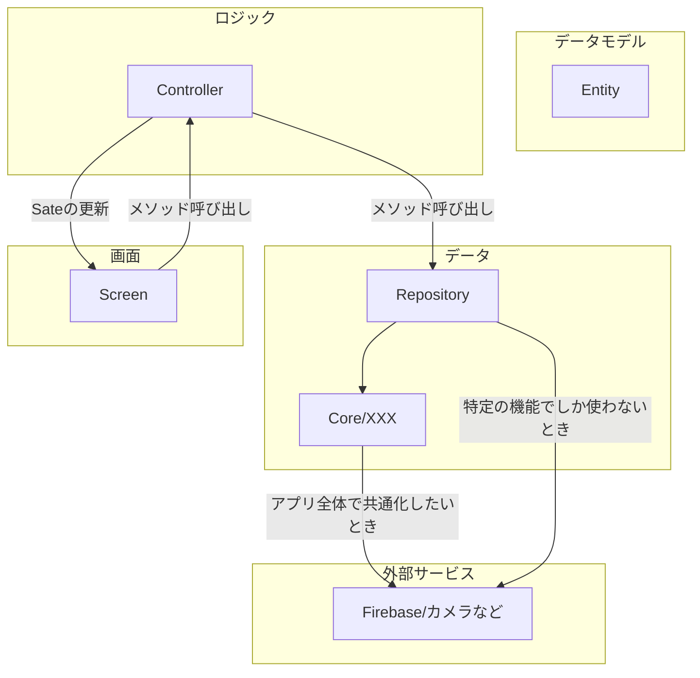

# Flutter App
## Coding
Flutterでは自動コード生成をよく用います。
これを行なってくれるのがBuild Runnerです。
riverpodやfreezedを使うクラスをいじった後は場合は次のコマンドを実行しましょう。
```sh
flutter pub run build_runner build --delete-conflicting-outputs
```
毎回実行するのは面倒だし時間もかかるので、次のコマンドを常時実行していれば問題ないです。
```sh
flutter pub run build_runner watch --delete-conflicting-outputs
```
もしくは[Build Runner](https://marketplace.visualstudio.com/items?itemName=GaetSchwartz.build-runner)という拡張機能を使うこともできます。
`Ctrl-shift-B`で自動コード生成して自動コード生成してくれます。
もしくは、左下に`(目のアイコン) Watch`があると思うのでコードを書き始めたらそれをクリックしておけば、常時ファイルの変更を監視してコード生成してくれます。
コード生成がうまくいっているかはエディターの`出力>Build Runner`から確認できます。

### コードスタイルガイド
#### 主要ディレクトリ構成
feature-firstが私の最近のお気に入りなのと、割と流行りなのでこれを取り入れています
```
- src/ (Dartプログラムは必ずこの下に置かれる)
  - core/ (アプリ全体に関わるファイル群)
    - app/ (アプリ最上位のwidget置き場)
    - auth/ (アプリ全体の認証の状態の管理)
    - components/ (アプリ共通のwidget)
    - hooks/ (custom hooks)
    - res/ (assetsなどの自動生成されるファイル)
    - router/ (ルーティング関連)
    - utils/ (その他)
  - features/
    - auth/ (アプリの認証機能など)
    - counter/ (サンプルプログラム)
    - chat/ (サンプルプログラム)
    - settings/ (設定画面)
```
各ディレクトリには`index.dart`を用意しましょう。
上位のディレクトリから下位の`index.dart`を読み込んでいるので、`'package:cheers_planner/index.dart';`
さえインポートすればプログラム全体にアクセスできます。

基本的に困ったら`features/featureXXX/`におけば問題ないです。
`features/featureXXX/`には次のような感じでファイルを配置してください。
- index.dart (全てのファイルをエクスポートするためのファイル)
- xxx_screen.dart (画面に関するファイル)
- xxx.dart (freezedを使ったモデル)
- xxx_controller.dart (ロジック)
- xxx_repo.dart (firebaseやローカルの機能などにアクセスする部分のラッパープログラム)
あんまり具体的にこれといったアーキテクチャをそのまま落とし込んでいるわけではないので申し訳ないですが、
ChatGPT曰く、「Clean Architecture を簡易化した MVVM＋Feature-First 構成」らしいです。


#### アーキテクチャ図

以下の図は、Repository・Controller・Screen と Firebase/ローカルサービスの関係性を示しています。



## おすすめの設定
```json
{
    "editor.formatOnSave": true,
    "editor.codeActionsOnSave": {
        "source.fixAll": "always",
        "source.organizeImports": "always",
    },
    "explorer.fileNesting.patterns": {
        "*.dart": "$(capture).g.dart, $(capture).freezed.dart",
        "pubspec.yaml": ".flutter-plugins, .packages, .dart_tool, .flutter-plugins-dependencies, .metadata, .packages, pubspec.lock, build.yaml, analysis_options.yaml, all_lint_rules.yaml, devtools_options.yaml, l10n.yaml, dart_test.yaml, custom_lint.log, untranslated_messages_file.txt, flutter*.yaml",
    }
}