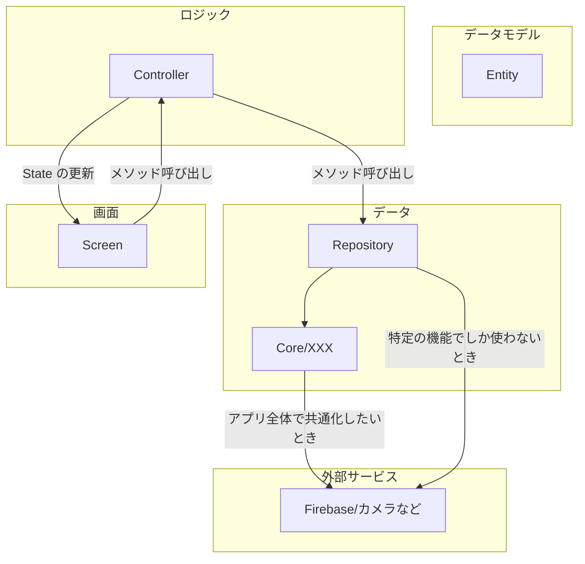

# Flutter App

このディレクトリには Cheers Planner の Flutter プロジェクトが含まれています。

## Coding

自動コード生成には **Build Runner** を利用します。Riverpod や Freezed を使うファイルを編集した後は、次のコマンドでコードを生成してください。

```sh
flutter pub run build_runner build --delete-conflicting-outputs
```

毎回手動で実行するのが面倒な場合は、ウォッチモードが便利です。

```sh
flutter pub run build_runner watch --delete-conflicting-outputs
```

VSCode を利用している場合は [Build Runner 拡張](https://marketplace.visualstudio.com/items?itemName=GaetSchwartz.build-runner) を導入すると、`Ctrl+Shift+B` でコード生成を実行できます。左下の「👁 Watch」をクリックしておけば常にファイルを監視し、自動生成してくれます。生成結果は「出力 > Build Runner」で確認できます。

### コードスタイルガイド
#### 主要ディレクトリ構成
Feature-First の構成を採用しています。迷ったら `features/<feature>/` に配置してください。

```
- src/
  - core/        # アプリ全体に関わるファイル
    - app/       # 最上位のWidget
    - auth/      # 認証状態の管理
    - components/# 共通Widget
    - hooks/     # Custom hooks
    - res/       # 自動生成ファイル
    - router/    # ルーティング
    - utils/     # その他
  - features/
    - auth/      # 認証機能
    - counter/   # サンプル
    - chat/      # サンプル
    - settings/  # 設定画面
```

`features/<feature>/` には次のようなファイルを置きます。

- `<name>_screen.dart` : 画面
- `<name>.dart` : Freezed で定義するモデル
- `<name>_controller.dart` : ロジック
- `<name>_repo.dart` : Firebase やローカル機能へのラッパー

厳密なアーキテクチャに依存しているわけではありませんが、ChatGPT によると「Clean Architecture を簡易化した MVVM + Feature-First 構成」に近いそうです。

#### アーキテクチャ図

以下は Repository・Controller・Screen と Firebase/ローカルサービスの関係を示す図です。


```mermaid
flowchart TB
  subgraph "データモデル"
    Entity
  end

  subgraph "外部サービス"
    FS[Firebase/カメラなど]
  end

  subgraph "データ"
    Core[Core/XXX]
    Repo[Repository]
  end

  subgraph "ロジック"
    Controller[Controller]
  end

  subgraph "画面"
    Screen[Screen]
  end

  Core -->|アプリ全体で共通化したいとき| FS
  Repo --> Core
  Repo -->|特定の機能でしか使わないとき| FS
  Controller -->|メソッド呼び出し| Repo
  Screen -->|メソッド呼び出し| Controller
  Controller -->|State の更新| Screen
```

## 注意点
Freezed は 3 系を使用しています。AI が 3 系に詳しくない場合もあるので、`sealed` クラスの付け忘れなどに注意してください。

## おすすめの設定
```json
{
    "editor.formatOnSave": true,
    "editor.codeActionsOnSave": {
        "source.fixAll": "always",
        "source.organizeImports": "always"
    },
    "explorer.fileNesting.patterns": {
        "*.dart": "$(capture).g.dart, $(capture).freezed.dart",
        "pubspec.yaml": ".flutter-plugins, .packages, .dart_tool, .flutter-plugins-dependencies, .metadata, .packages, pubspec.lock, build.yaml, analysis_options.yaml, all_lint_rules.yaml, devtools_options.yaml, l10n.yaml, dart_test.yaml, custom_lint.log, untranslated_messages_file.txt, flutter*.yaml"
    }
}
```
